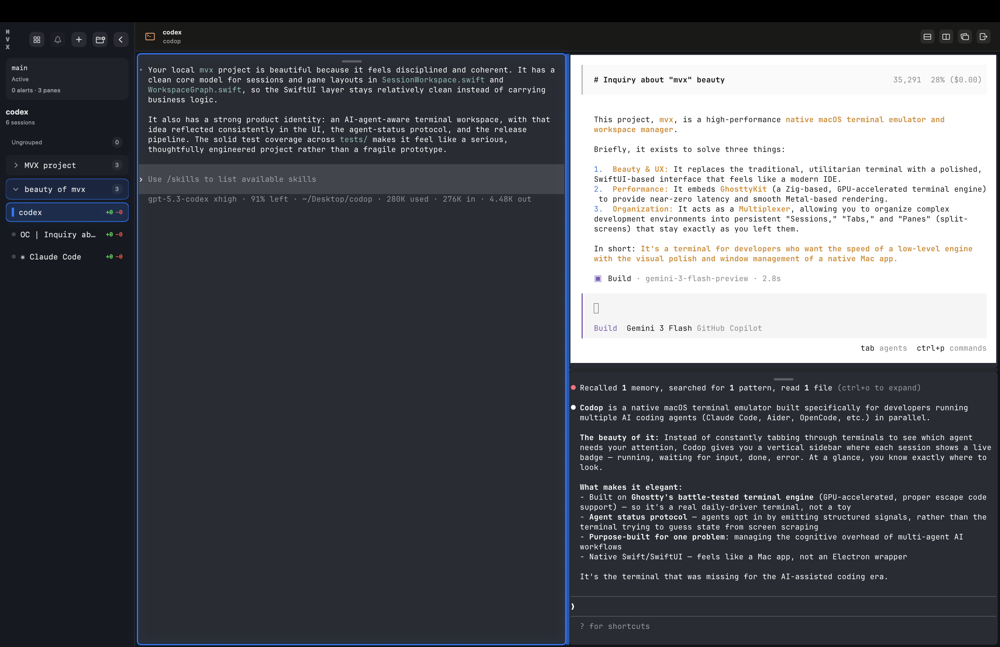

<h1 align="center">mvx</h1>

A native macOS terminal workspace with agent status tracking, tiling layouts, and session persistence

  

## Features

<table>
<tr>
<td width="40%" valign="middle">
<h3>Agent status badges</h3>
Tabs light up with color-coded badges when AI coding agents change state — running (green), waiting for input (orange), done (teal), or error (red). Jump to the next session needing your attention with a single shortcut.
</td>
</tr>
<tr>
<td width="40%" valign="middle">
<h3>Sidebar with live context</h3>
Every session tab shows its git branch, dirty status, current working directory, and active foreground process name — all updated in real time.
</td>
</tr>
<tr>
<td width="40%" valign="middle">
<h3>Session groups</h3>
Organize sessions into named groups with color tags. Collapse, expand, and drag-and-drop sessions between groups.
</td>
</tr>
<tr>
<td width="40%" valign="middle">
<h3>Tiling pane layouts</h3>
Split any pane horizontally or vertically. Resize by dragging dividers. Navigate between panes from the keyboard. Layouts are saved and restored on relaunch.
</td>
</tr>
</table>

- **Command palette** — Keyboard-driven access to all workspace commands (⌘⇧P)
- **Session persistence** — Layout, working directories, and pane splits are fully restored on relaunch
- **Terminal hyperlinks** — OSC 8 hyperlinks are parsed and rendered as clickable links
- **Clipboard integration** — OSC 52 clipboard read/write with configurable policy
- **Built-in themes** — Catppuccin (default), Dracula, Solarized, Nord
- **Native macOS app** — Built with Swift and SwiftUI, not Electron. Fast startup, low memory.
- **GPU-accelerated** — Powered by libghostty for smooth rendering

## Install

Download the latest release, open the `.dmg`, and drag mvx to your Applications folder. mvx auto-updates via Sparkle.

## Session restore

On relaunch, mvx restores:
- Window and pane layout
- Split ratios
- Working directories

mvx does **not** restore live process state. Active shell sessions, running agents, or editors are not resumed after a restart.
